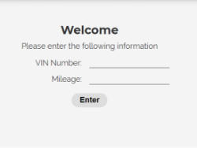
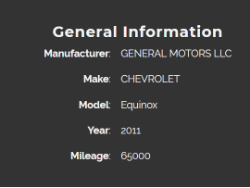
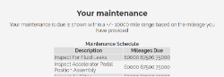

# [**yourCARe**](https://justdorah.github.io/youCARe2/)

### **About this app:**

**Description**  
Users can access their car manufacturer maintenance schedule through their vin number+.  
    * API- carMD
    * Vehicle API - NHTSA  

[**Click**](https://justdorah.github.io/youCARe2/) for live page    
  
**Screenshot**  

    

  

  

    

**Technologies**  
* HTML
* CSS
* JavaScript/JQuery

---
+Maintenance information is based on +/- 10000miles of submitted mileage  
